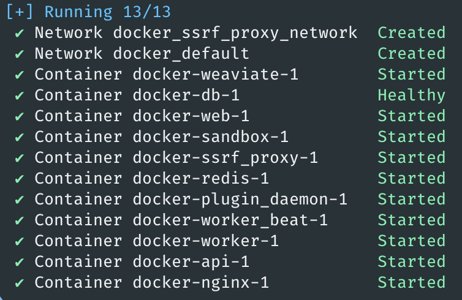
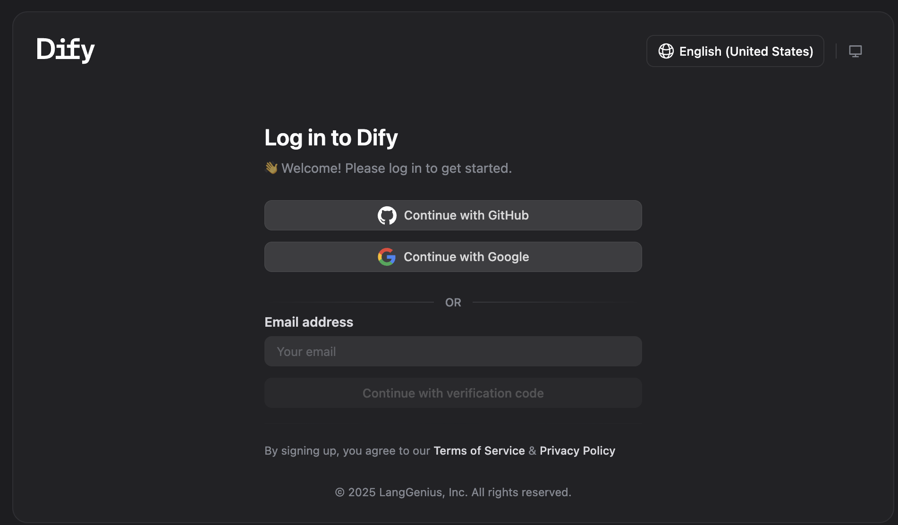
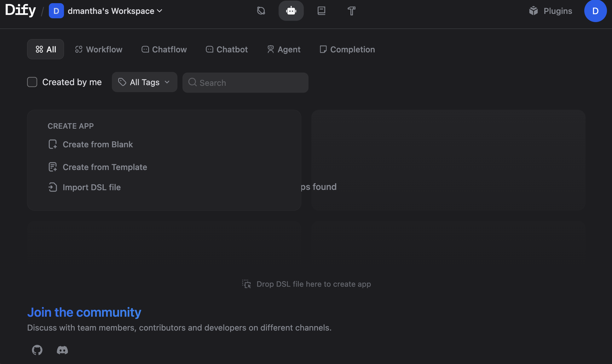
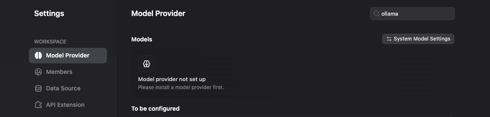
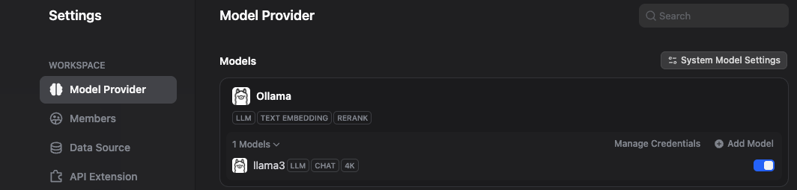
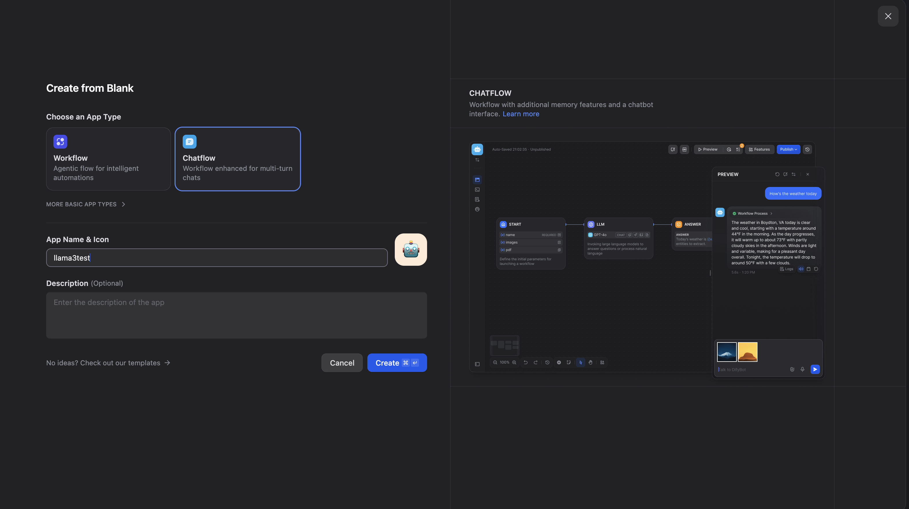
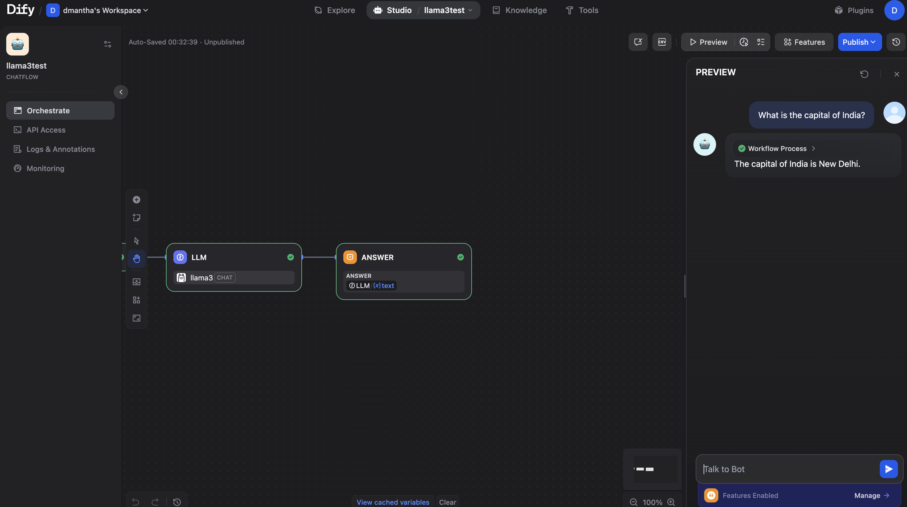
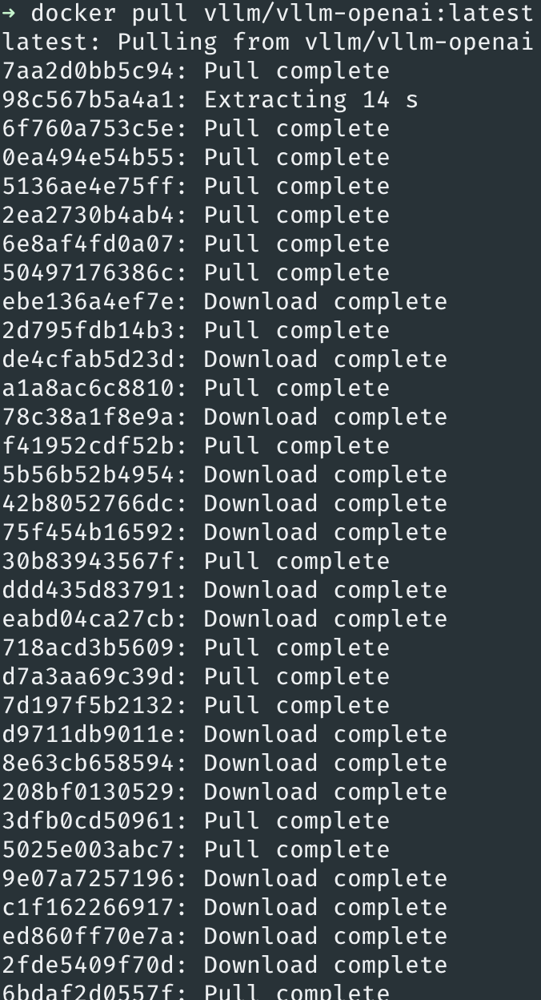

# 🧠 Welcome to Dify

This guide explains how to set up Dify, a powerful open-source platform for building and managing AI applications.
You’ll learn how to install Dify using Docker, run it locally, and prepare it to connect with Ollama for local LLM integrations.

## 🧩 Introduction
Dify provides a developer-friendly interface to build, test, and deploy AI workflows using large language models (LLMs).
It includes visual tools, API access, and model integration options for local or cloud-based LLMs.

## ⛭ Prerequisites:
Before installing Dify, ensure the following tools are installed and configured:

	-	Operating System: macOS, Linux, or Windows (with WSL)
	-	Docker & Docker Compose
	-	Git
	-	Internet Connection (for pulling Docker images)
	-	(Optional) Ollama — required if you want to run local models
	   -	Ollama must be installed and running
	   -	The model you plan to use must be already pulled and served

### 📕 Step 1: Install Docker Desktop  

Check the [Docker Setup Guide](docker-setup.md) to install Docker Desktop on your machine.

## 🧠 Step 2: Install Dify (Clone Git Repository)

Create a workspace folder:   
   ```bash
   mkdir frugal-ai-env
   cd frugal-ai-env
   ```

Clone the Dify repository:
   ```bash
   git clone https://github.com/langgenius/dify.git
   ```
Dify already includes a complete Docker setup — no need to create any Dockerfiles.

Folder structure:
   ```bash
   frugal-ai-env/
   └── dify/
    ├── dify/
    ├── pyproject.toml
    └── README.md
   ```
## 🧠 Step 3: Run Dify using Docker Compose   
Navigate to the Dify docker directory:

   ```bash
   cd dify/docker
   ```
Start Dify using Docker Compose:
   ```bash
   docker-compose up -d
   ```
Expected output:
   
 

You should see something similar:
   ```bash
   docker ps
   ```
Expected output:
```
CONTAINER ID   IMAGE                                       COMMAND                  CREATED          STATUS                    PORTS                                      NAMES
199430fb6877   nginx:latest                                "sh -c 'cp /docker-e…"   23 minutes ago   Up 23 minutes             0.0.0.0:80->80/tcp, 0.0.0.0:443->443/tcp   docker-nginx-1
01e9e0f54106   langgenius/dify-api:1.9.2                   "/bin/bash /entrypoi…"   23 minutes ago   Up 23 minutes             5001/tcp                                   docker-api-1
bd9afd011ce5   langgenius/dify-api:1.9.2                   "/bin/bash /entrypoi…"   23 minutes ago   Up 23 minutes             5001/tcp                                   docker-worker-1
a689bd01c737   langgenius/dify-api:1.9.2                   "/bin/bash /entrypoi…"   23 minutes ago   Up 23 minutes             5001/tcp                                   docker-worker_beat-1
46f91928f5e1   langgenius/dify-plugin-daemon:0.3.3-local   "/bin/bash -c /app/e…"   23 minutes ago   Up 23 minutes             0.0.0.0:5003->5003/tcp                     docker-plugin_daemon-1
70215069ec9c   postgres:15-alpine                          "docker-entrypoint.s…"   23 minutes ago   Up 23 minutes (healthy)   5432/tcp                                   docker-db-1
eb82c8de6c1c   redis:6-alpine                              "docker-entrypoint.s…"   23 minutes ago   Up 23 minutes (healthy)   6379/tcp                                   docker-redis-1
5ea06dcd9a1d   langgenius/dify-web:1.9.2                   "/bin/sh ./entrypoin…"   23 minutes ago   Up 23 minutes             3000/tcp                                   docker-web-1
e7d573601afe   langgenius/dify-sandbox:0.2.12              "/main"                  23 minutes ago   Up 23 minutes (healthy)                                              docker-sandbox-1
d8c85bb58f8c   semitechnologies/weaviate:1.27.0            "/bin/weaviate --hos…"   23 minutes ago   Up 23 minutes                                                        docker-weaviate-1
ebd8732ce4fd   ubuntu/squid:latest                         "sh -c 'cp /docker-e…"   23 minutes ago   Up 23 minutes             3128/tcp                                   docker-ssrf_proxy-1
```
## 🧠 Step 4: Access the Dify Dashboard
Open:
  👉🏻 http://localhost:3000 
Choose a login method: 
   

You will now see the Dify dashboard:



## 🧠 Step 5: Install and Configure Ollama (Model Provider)

Install Ollama (if not already installed):
   👉 https://ollama.com/download
Then open:   
Settings -> Model Provider-> Ollama



## 🧠 Step 6: Prechecks Before Conecting Ollama with Dify

✔️ 1. Ensure Ollama is running
```bash
   ollama serve
   ```
✔️ 2. Ensure your model is already pulled   ```
```bash
   ollama list
   ```
   Example:
   ```bash
   llama3:latest 
   ```

(Optional — only if you want to test manually)  
✔️ 3.Start the model(if needed)
```bash
   ollama run llama3
```
⚠️ Important:
Dify runs inside Docker, but Ollama runs on your host machine.
Therefore Dify must access Ollama via host.docker.internal.

## 🧠 Step 7: Connect Ollama Model with Dify

 Go to:
  Settings -> Model Provider -> Ollama -> Add Model


Enter the following details and click on add:
- Model Name: `llama3`  
- Model Type: 'LLM'  
- Base URL: 
```bash
`http://host.docker.internal:11434`
```


Reload Dify.

The model will appear under the Ollama provider:


## 🧠 Step 8: Create a Chat App Using Ollama in Dify

Click on **Create from Blank**
   
Enter details -> **Create**

A new chatflow opens. Click Preview to open the chatbot.
Interact with your local model:



Second:

1. Lets install VLLM on mac using the existing docker image
   ```bash
   docker pull vllm/vllm:latest
   
   
   
2. Run the VLLM docker container with port 8000 exposed
   ```bash
   docker run -it --rm -p 8000:8000 \
    vllm/vllm-openai:latest \
    --model meta-llama/Meta-Llama-3-8B-Instruct
   ```
   

      
